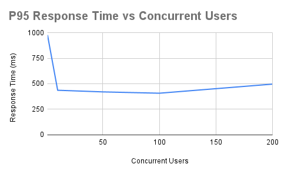
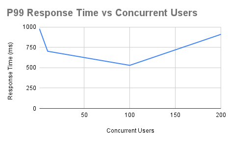
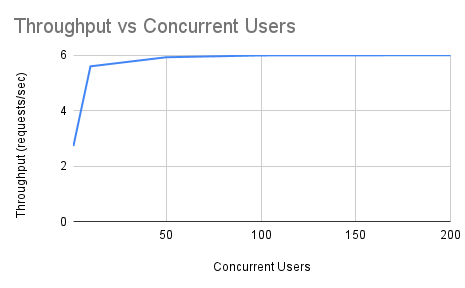

# FakeStore API Performance Analysis Report

---

# 1. Executive Summary

Performance testing was conducted on the FakeStore API using Apache JMeter to evaluate system performance, scalability, stability, and capacity under increasing concurrent user load.

A realistic end-to-end e-commerce user journey was simulated:

Login → Browse Products → View Product → Add Cart → View Cart

The system demonstrated strong stability, consistent response times, and zero request failures across all load levels.

Key performance findings:

• Average response time remained stable between 252 ms and 293 ms  
• Throughput increased proportionally with load until saturation  
• Maximum throughput capacity reached approximately 6 requests per second  
• System scaled efficiently up to 100 concurrent users  
• Beyond 100 users, throughput plateaued and response time variability increased  

P99 response time reached 909 ms at 200 concurrent users, indicating backend resource saturation and request queuing.

Overall, the system demonstrates reliable performance and predictable scalability within defined capacity limits.

---

# 2. Test Objective

Primary objectives of this performance test:

• Evaluate system responsiveness under increasing load  
• Determine maximum throughput capacity  
• Analyze high-percentile response times (P95 and P99)  
• Identify performance bottlenecks and saturation points  
• Establish safe concurrent user capacity  
• Validate system stability and reliability under stress  

These objectives help determine production readiness and scalability limits.

---

# 3. Test Environment

| Component | Details |
|---------|---------|
| Tool | Apache JMeter 5.6.3 |
| Protocol | HTTPS |
| API Tested | https://fakestoreapi.com |
| Test Machine | Windows |
| Test Type | Load Testing |
| Correlation Method | JSON Extractor |
| Parameterization | CSV Data Set Config |
| Test Data | users.csv, products.csv |

All requests were executed under controlled and repeatable conditions.

---

# 4. User Flow Simulated

Each virtual user executed a complete transactional workflow representing real user behavior:

1. Login using valid credentials  
2. Browse available products  
3. View individual product details  
4. Add product to cart  
5. View cart using dynamically extracted cartId  

Correlation implementation ensured accurate session simulation:

POST /carts → Extract cartId  
GET /carts/${cartId} → View Cart

This prevents hard-coded values and ensures realistic dynamic execution.

---

# 5. Load Profile Executed

The system was tested under progressively increasing concurrent user load:

| Load Level | Concurrent Users | Ramp-up Time |
|-----------|-----------------|-------------|
| Baseline | 1 | 1 sec |
| Light Load | 10 | 10 sec |
| Medium Load | 50 | 50 sec |
| Heavy Load | 100 | 100 sec |
| Stress Load | 200 | 200 sec |

Gradual ramp-up ensures realistic load distribution and prevents artificial spikes.

---

# 6. Performance Metrics Summary

| Users | Avg Response (ms) | P95 (ms) | P99 (ms) | Throughput (req/sec) | Error Rate |
|------|------------------|----------|----------|----------------------|-----------|
| 1 | 366 | 978 | 978 | 2.72 | 0% |
| 10 | 274 | 436 | 702 | 5.59 | 0% |
| 50 | 277 | 420 | 625 | 5.92 | 0% |
| 100 | 252 | 407 | 529 | 5.98 | 0% |
| 200 | 293 | 496 | 909 | 5.99 | 0% |

These metrics provide insight into system responsiveness, stability, and capacity.

---

# 7. Average Response Time Analysis

## Response Time vs Concurrent Users

Observation:

• Average response time remained stable across all load levels  
• Response time improved initially as system resources were efficiently utilized  
• Slight increase at 200 users indicates resource contention and queuing  

Interpretation:

Stable average response time indicates efficient load handling and balanced resource utilization.

Conclusion:

System maintains consistent response performance even under stress load.

---

# 8. P95 Response Time Analysis

## P95 Response Time vs Concurrent Users

P95 represents the response time experienced by 95% of users.

Observation:

• P95 response time improved significantly after baseline load  
• Stabilized between 400 ms and 500 ms  
• Slight increase at stress load  

Interpretation:

Majority of users experience fast and consistent performance.

Conclusion:

System delivers reliable performance for almost all users under load.

---

# 9. P99 Response Time Analysis (Critical Performance Indicator)

## P99 Response Time vs Concurrent Users

P99 represents worst-case response time experienced by 99% of users.

This is the most important metric for identifying performance bottlenecks.

Observation:

• P99 remained stable up to 100 concurrent users  
• Increased significantly to 909 ms at 200 users  

Interpretation:

High percentile latency increase indicates backend saturation and request queuing.

Conclusion:

System reaches performance limits beyond 100 concurrent users.

---

# 10. Throughput Analysis

## Throughput vs Concurrent Users

Throughput represents system processing capacity.

Observation:

• Throughput increased proportionally with load  
• Throughput plateaued at approximately 6 requests per second  
• No throughput improvement beyond 100 concurrent users  

Interpretation:

Backend reached maximum processing capacity.

Conclusion:

System saturation point identified at approximately 100 concurrent users.

---

# 11. Error Rate Analysis

Error Rate Observed: 0%

Observation:

• No request failures occurred  
• System remained fully stable during stress load  

Conclusion:

System demonstrates excellent reliability and operational stability.

---

# 12. Bottleneck Identification

Performance bottleneck indicators observed at 200 users:

• Throughput plateaued  
• P99 latency increased significantly  
• Response time variability increased  

Interpretation:

Backend resources reached maximum utilization.

Requests began queuing due to limited processing capacity.

Conclusion:

System bottleneck occurs beyond 100 concurrent users.

---

# 13. System Capacity Analysis

Maximum throughput capacity identified:

≈ 6 requests per second

Optimal performance range:

10 to 100 concurrent users

Beyond this range:

• No throughput improvement  
• Increased response time variability  
• Reduced performance efficiency  

Conclusion:

100 concurrent users represents optimal operating capacity.

---

# 14. Scalability Analysis

System demonstrated effective horizontal scalability up to 100 concurrent users.

Scalability evidence:

• Linear throughput increase with load  
• Stable average response times  
• Zero error rate  

Scalability limitation indicators beyond 100 users:

• Throughput plateau  
• Increased P99 latency  
• Resource saturation symptoms  

Conclusion:

System scales efficiently within defined capacity limits.

---

# 15. Stability Analysis

System remained fully stable during all test scenarios.

Evidence:

• Zero request failures  
• No crashes observed  
• Consistent response behavior  

Conclusion:

System demonstrates high reliability under load.

---

# 16. Correlation Validation

Dynamic cartId extraction implemented using JSON Extractor.

Extraction:

$.id → cartId

Usage:

GET /carts/${cartId}

This ensures accurate session simulation and prevents data reuse.

---

# 17. Final Performance Verdict

Performance testing confirms that FakeStore API demonstrates strong stability, predictable performance, and efficient scalability under increasing concurrent user load.

Key findings:

• Stable performance up to 100 concurrent users  
• Maximum throughput capacity ≈ 6 requests/sec  
• Zero error rate across all load levels  
• Backend saturation begins beyond 100 users  
• P99 latency increase confirms capacity limits  

Production Readiness Assessment:

System is production-ready for moderate concurrent user load.

Safe concurrent user capacity:

≤ 100 concurrent users

Beyond this threshold, backend scaling is recommended.

---

# 18. Recommendations

To improve scalability and increase capacity:

Infrastructure Recommendations:

• Implement load balancing  
• Add horizontal scaling  
• Increase backend compute resources  

Application Optimization Recommendations:

• Optimize backend processing logic  
• Implement caching mechanisms  
• Optimize database queries  

Monitoring Recommendations:

• Monitor P95 and P99 latency in production  
• Track throughput trends  
• Monitor system resource utilization  

---

# End of Report
